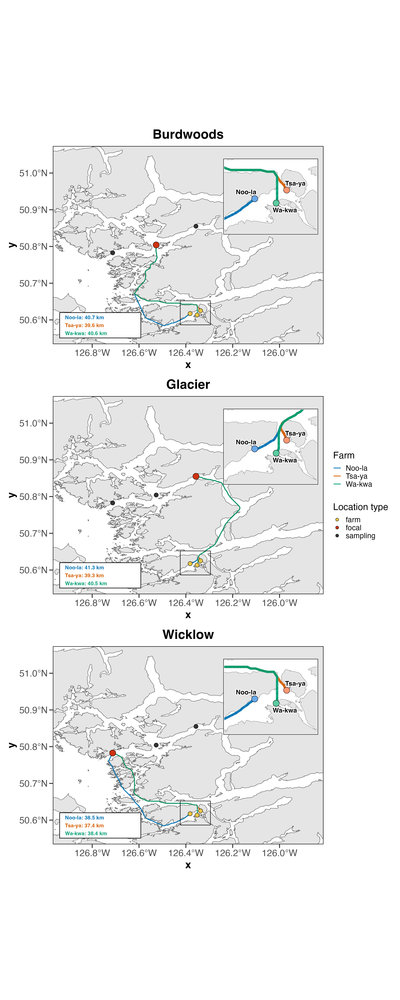

# seaway-distance
A demo of how to calculate seaway distance using the `sf` package in R :boat:

Want to figure out how far it is from one place to some other places? Here you go :) It's probably not the most efficient version ever but it was fun to do. 

## Here's the output map I generated in about 1000 total lines of code

